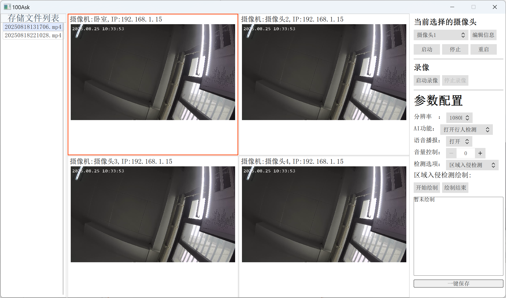

# AI MPP Camera QT GUI APP

## 简介

​	AI MPP Camera QT GUI APP 是一个跨平台（Windows / Linux / macOS）的 Qt/C++ 上位机，专为 **全志 V853 IPC 方案** 设计与百问网AI音视频课程配套使用。
​	它通过 **RTSP** 拉取 V853 实时 H.264/H.265 码流，本地录制为 **MP4** 文件，同时通过 **TCP Socket** 与 V853 上的守护进程通信，完成摄像机启停、参数配置、AI 检测开关等远程控制。

​	百问网AI音视频课程：[课程购买链接](https://detail.tmall.com/item.htm?abbucket=5&id=777414792957)



## 功能特性

| 功能           | 描述                                                     |
| -------------- | -------------------------------------------------------- |
| **实时预览**   | 多路 RTSP 码流同步播放，支持 1080p/720p 自适应           |
| **本地录制**   | 即时录制为 MP4，支持分段、暂停/恢复、自定义保存路径      |
| **摄像机管理** | 添加/删除/编辑摄像机信息（IP、端口、通道）               |
| **远程控制**   | 启动/停止/重启摄像机；开关行人检测、区域入侵、语音播报等 |
| **参数配置**   | 分辨率、帧率、码率、音量、检测区域绘制（可视化）         |


## 环境搭建

开始前请请准备以下两个环境：

1、QT SDK的开发环境；（安装之后，自然就会包含Windows下C和C++的环境）

2、ffmpeg的Windows dll库；


使用QT Creator进行编译！


## 项目结构

```
core
    ├── CameraConfig.cpp				#PC端GUI的摄像机配置文件，例如读取，写入，更新等操作
    ├── CameraConfig.h
    ├── CameraPaintItem.cpp				#负责画面绘制功能，图像渲染等功能
    ├── CameraPaintItem.h
    ├── main.cpp						#程序主入口
    ├── mainBackend.cpp					#程序一些后台操作
    ├── mainBackend.h
    ├── media							#存放媒体功能的源码目录
    │   ├── MediaCore.cpp				#辅助类，为录像和媒体流提供支撑
    │   ├── MediaCore.hpp
    │   ├── MediaRecord.cpp				#录像功能
    │   ├── MediaRecord.hpp
    │   ├── MediaStream.cpp				#媒体流的播放拉流功能
    │   ├── MediaStream.hpp
    │   ├── ffmpeg_common.cpp			#辅助类，为录像和媒体流提供支撑
    │   └── ffmpeg_common.h				#ffmpeg的公共头文件
    ├── updata_common.h 				#与update_config_server当中的一致
    ├── updateconfigclient.cpp			#与update_config_server通讯层
    └── updateconfigclient.h
```


## 通信协议

参数通信：上位机 ↔ V853 通过 **TCP SOCKET**（端口 80）交互。

视频流通信：V853-> 上位机通过RTSP获取码流，并进行封装MP4。


## 贡献指南

欢迎 Issue / PR。
代码风格遵循 `clang-format`，提交前执行：

```
clang-format -i src/**/*.cpp src/**/*.h
```


